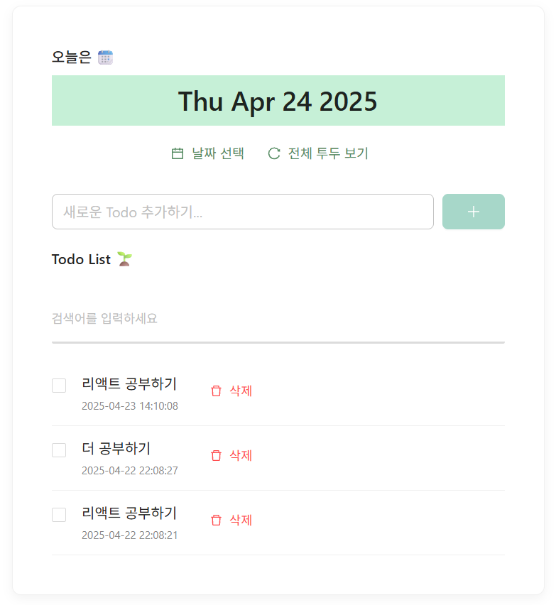

# clushTodoList




## 1. 프로젝트 설명
Spring Boot + React 기반의 투두리스트(할 일 관리) 웹입니다.

사용자는 할 일을 등록, 수정, 삭제, 검색 할 수 있습니다.

---

## ✅ 백엔드 (Java 17 + Spring Boot 3.0.3 로컬 서버)
```
back/
├── src/
│   ├── main/
│   │   ├── java/clush/back/
│   │   │   ├── BackApplication.java          # 메인 클래스
│   │   │   ├── controller/
│   │   │   │   └── TodoController.java       # 컨트롤러
│   │   │   ├── dto/
│   │   │   │   └── TodoDTO.java              # DTO 객체
│   │   │   ├── persistance/mapper/
│   │   │   │   └── ITodoMapper.java          # MyBatis 매퍼 인터페이스
│   │   │   └── service/
│   │   │       ├── impl/
│   │   │       │   └── TodoService.java      # 서비스 구현체
│   │   │       └── ITodoService.java         # 서비스 인터페이스
│   │   └── resources/
│   │       ├── application.properties        # 설정 파일
│   │       └── mapper/
│   │           └── ITodoMapper.xml           # MyBatis 쿼리
├── test/
│   └── java/clush/back/
│       └── BackApplicationTests.java         # 테스트
└── pom.xml                                   # Maven 설정
```

---

## ✅ 프론트 (React.JS + Vite)
```
front/
├── src/
│   ├── components/
│   │   ├── Header.jsx                  # 상단 날짜 헤더
│   │   ├── Editor.jsx                  # Todo 입력창
│   │   ├── List.jsx                    # Todo 목록 전체
│   │   ├── TodoItem.jsx                # Todo 개별 항목
│   │   └── (CSS 파일 각 컨트롤 단위)
│   ├── App.jsx                         # 메인
│   ├── App.css                         # 메인 CSS
│   └── main.jsx                        # 시작 점
├── package.json                        # 의존성 & 스크립트
└── vite.config.js                      # Vite 설정
```

---

## ✅ 데이터베이스 (MySQL 8.0 로컬)
```
┌────────────────────────────────────────┐
│               TODOLIST                 │
├────────────────────────────────────────┤
│ PK  TODO_SEQ      INT (AUTO_INCREMENT) │
│     CONTENTS      VARCHAR(1000)        │
│     STATUS        BOOLEAN (default: 0) │
│     REG_DT        DATETIME             │
│     CHG_DT        DATETIME             │
└────────────────────────────────────────┘
```


---


## 2. 소스 빌드 & 시작 (로컬)


### 🔧 GitHub에서 프로젝트 클론

```bash
git clone https://github.com/sssoj0612/clushTodoList.git
cd clushTodoList
```

## 💾 DB
- 설명: 로컬 개발용 MySQL DB 초기 세팅 방법입니다.
- 기초 데이터 파일 위치: `back/db/todo_todolist.sql`
- 사용법:
  1. MySQL Workbench 8.0 실행
  2. Server → Data Import
  3. 파일 선택 후 Start Import 클릭


### 🚀 백엔드
```bash
cd back
mvn clean install
java -jar target/back-0.0.1-SNAPSHOT.jar
```

### 🚀 프론트
```bash
cd front
npm install
npm run dev
```

### 🚀 http://localhost:5173/ 에서 확인.


---


## 3. 주력으로 사용한 라이브러리

### ✔️ 백엔드
- **MyBatis** : 복잡한 SQL 제어가 쉬움, 직관적인 쿼리 관리
- **Lombok** : 어노테이션 기반 코드 축소 도구 + DTO, 서비스에서 Getter/Setter 자동 생성으로 생산성 향상

### ✔️ 프론트
- **Vite** : 고속 시작 & 바로 변경 확인 가능
- **Axios** : REST API 과의 HTTP 통신을 간편하게 처리
- **react-datepicker** : 캘린더 사용
- **dayjs** : 날짜 형식(같은 YYYY-MM-DD) 변환을 위한 라이브러리

---


## 4. API 명세


- Swagger 연동 클릭 : [http://localhost:11000/swagger-ui/index.html](http://localhost:11000/swagger-ui/index.html)


---


## 5. 테스트케이스

### ✅ JUnit 5 기반의 자바 프로젝트 테스트

#### 파일 위치
```
src/test/java/clush/back/BackApplicationTests.java
```

#### 테스트 실행 방법
```bash
cd back
mvn test
```

#### 테스트 역할

| 순서 | 테스트명    | 설명 |
|--------|------------------|--------------------------------------------|
| 1️⃣     | 등록 테스트   | Todo가 정상적으로 등록되는지 확인 |
| 2️⃣     | 조회 테스트   | 등록된 Todo가 목록에 나오는지 확인 |
| 3️⃣     | 수정 테스트   | Todo의 내용과 상태가 올바르게 변경되는지 검증 |
| 4️⃣     | 삭제 테스트   | Todo가 정상적으로 삭제되는지 확인 |


---


## 6. 기본 기능 외 추가 기능
- 투두리스트 검색 기능 추가
- 선택한 날짜에 작성한한 투두리스트만 조회하는 기능 추가

---

